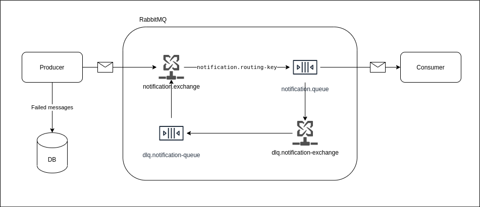

# Getting Started

### Reference Documentation

For further reference, please consider the following sections:

* [Spring for RabbitMQ](https://docs.spring.io/spring-boot/docs/2.5.6/reference/htmlsingle/#boot-features-amqp)
* [Dead Letter Queue](https://stackoverflow.com/questions/63620066/springboot-rabbitmq-dlq-queue-not-working)

### Guides

docker run --rm -it --hostname my-rabbit -p 15672:15672 -p 5672:5672 rabbitmq:3-management
[RabbitMQ Management](http://localhost:15672)



### Usage
```
POST:
localhost:8080/v1/producer

{
    "message": "New Message"
}
```
